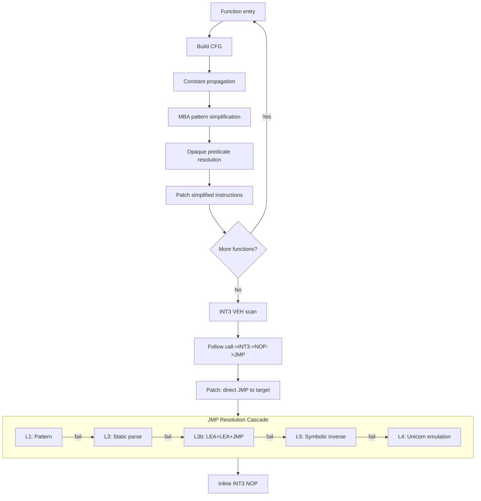
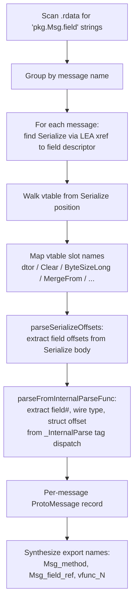
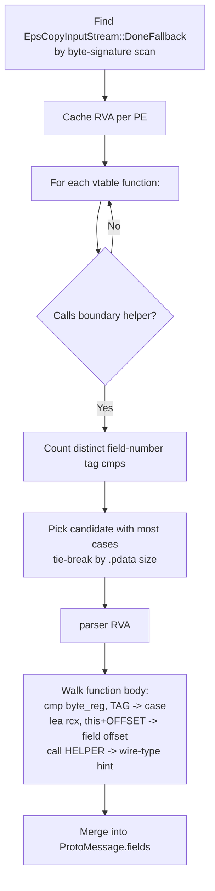
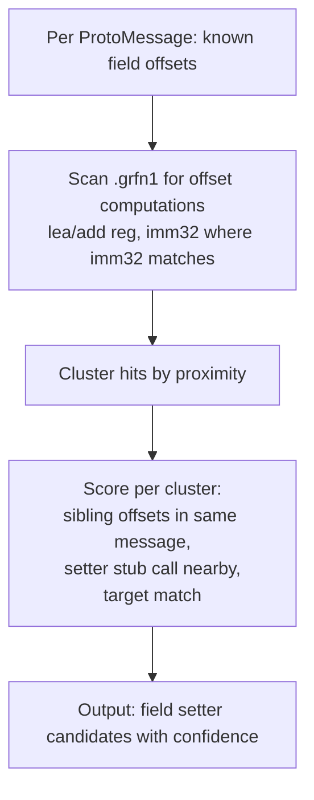
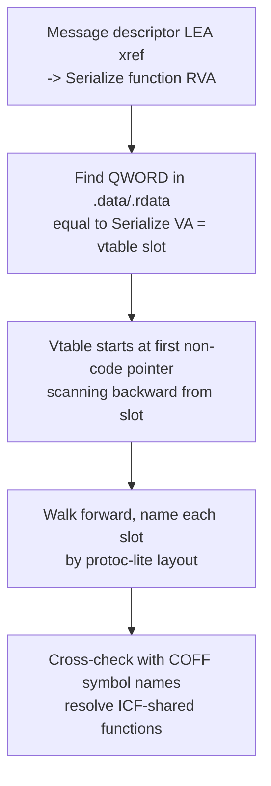

# Algorithms

Phase-level orchestration is in [PIPELINE.md](PIPELINE.md). This file covers the
specific techniques used inside individual phases.

## Griffin deobfuscation

## Protobuf message discovery

## _InternalParse identification (table-driven build)

For protobuf-lite + table-driven builds, the per-message `Serialize`/`ByteSizeLong`
exports are short thunks; the real wire-format dispatch lives in `_InternalParse`,
which is named generically (`vfunc_N`, `InternalSwap`, etc.) by the deobf pass.

## Field setter discovery

## Vtable resolution

