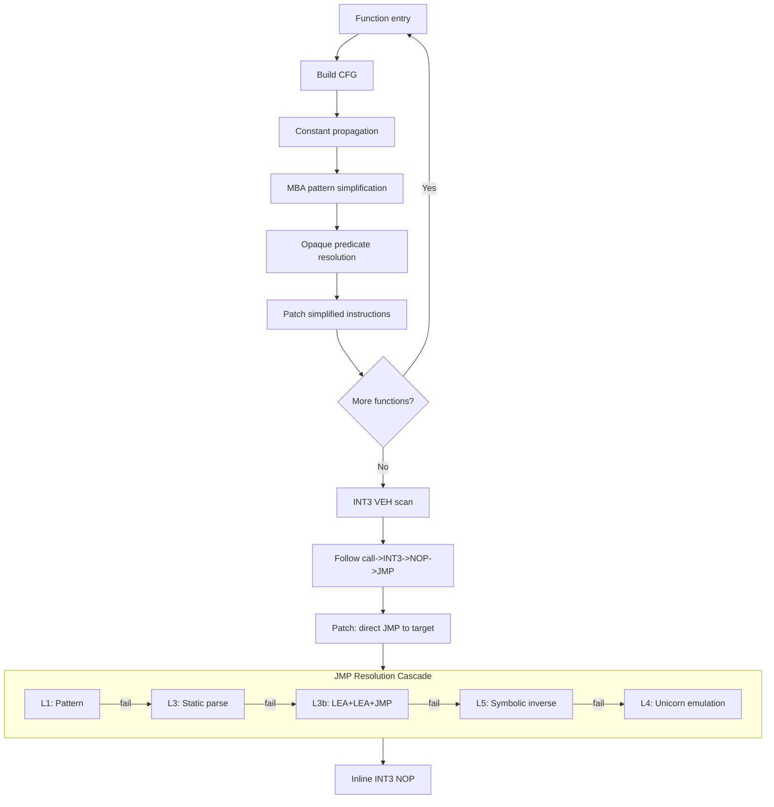
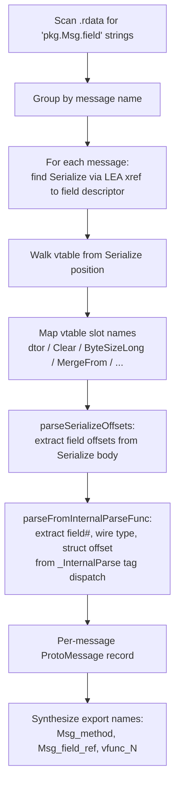
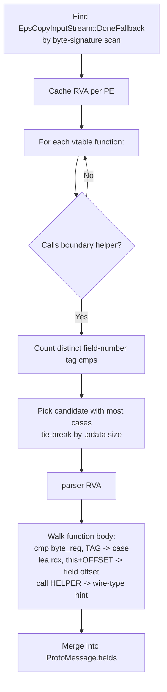
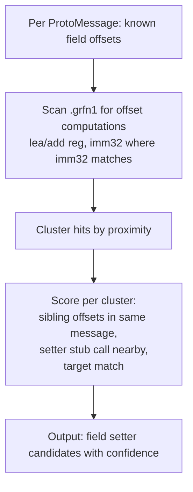
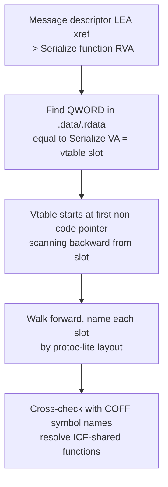
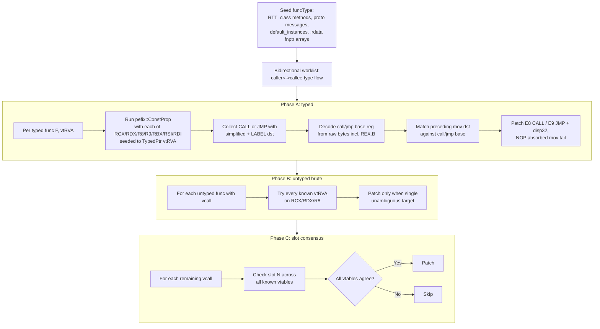

# Algorithms

Phase-level orchestration is in [PIPELINE.md](PIPELINE.md). This file covers the
specific techniques used inside individual phases.

Two cross-library passes are covered in their owning repos:

- **Function boundary recovery (FBR)** — multi-source seeds (pdata / export /
  RTTI / EH / data fnptrs) plus caller-driven expansion through E8/E9 targets,
  validated by a score-based filter. Pipeline runs it twice (Phase 2 measurement,
  Phase 5 L4 input). Full flowchart in
  **[libpefix/ALGORITHMS.md#function-boundary-recovery-fbr](../libpefix/ALGORITHMS.md)**.
- **Layered xref reachability** — L1 `.grfn1` roots, L2 export roots, L3 fnptr
  roots, plus the append-only L4 FBR augmentation that registers `.rdata`
  targets reachable from FBR-discovered functions the other layers miss. Full
  flowchart in
  **[libgriffin/ALGORITHMS.md#layered-xref-reachability](../libgriffin/ALGORITHMS.md)**.

## Griffin deobfuscation

## Protobuf message discovery

## _InternalParse identification (table-driven build)

For protobuf-lite + table-driven builds, the per-message `Serialize`/`ByteSizeLong`
exports are short thunks; the real wire-format dispatch lives in `_InternalParse`,
which is named generically (`vfunc_N`, `InternalSwap`, etc.) by the deobf pass.

## Field setter discovery

## Vtable layout recovery

## Vtable call devirtualization

Once layouts are known, indirect vcalls and tail-call thunks of the form
`mov rax,[rcx]; call|jmp [rax+N]` get rewritten to a direct `call`/`jmp sub_X`.
Three resolver phases run after RTTI + type propagation:

The preceding-mov absorb step covers three encodings:

- 3-byte `mov reg, [base]`              (REX + 8B + modrm mod=00)
- 4-byte `mov reg, [base + disp8]`      (REX + 8B + modrm mod=01 + disp8)
- 7-byte `mov reg, [base + disp32]`     (REX + 8B + modrm mod=10 + disp32)

Each is only absorbed when the mov's destination register matches the call/jmp's
base register (accounting for REX.R and REX.B). This is what keeps the rewrite
semantically safe when an unrelated `mov` happens to sit immediately in front.

Phase A is where the bulk of patching lands; Phases B and C sweep residuals.
Untyped sites that reduce to a single vtable target via brute force or that
share a slot across every vtable (rare for class-specific layouts) get cleaned
up there. Sites that survive all three phases are typically constructor entries
that rewrite `rcx` from a parameter struct, container iterations with dynamic
indices, or member-object vcalls -- cases where abstract interpretation alone
cannot recover the type.
