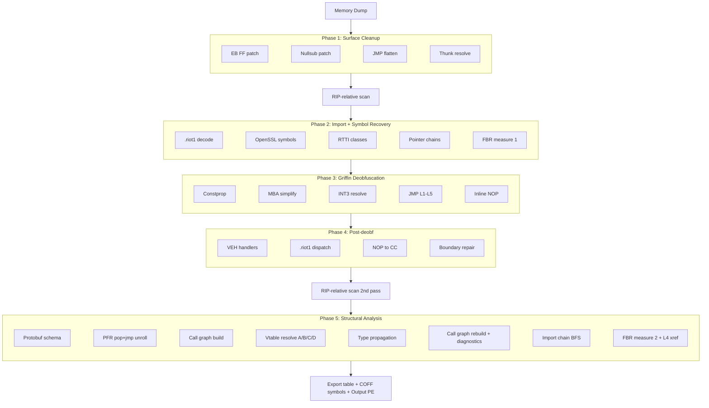

# Pipeline

End-to-end orchestration: which phases run, in what order, with what they hand off to
each other. Algorithmic detail for any individual phase lives in [ALGORITHMS.md](ALGORITHMS.md).

Phase boundaries also gate two RIP-relative scan passes: the first runs after Phase 1
so xref data feeds the symbol recovery in Phase 2; the second runs after Phase 4 so
deobfuscated code contributes refs that Phase 5 needs for vtable and protobuf work.

FBR runs twice. The first call sits in Phase 2 right after RTTI parsing — it
reports the discoverable function set against the original `.pdata` baseline as
a measurement-only sanity check, before any deobf has rewritten code. The second
call sits at the top of Phase 5 once deobf has expanded the reachable instruction
surface; its output feeds `griffin::extendWithFbrRoots` so xref reachability picks
up FBR-only roots as an `XrefLayerFbr` (L4) augmentation. Both calls are
side-effect free against the PE bytes — they read only.

The Phase 5 call graph is built twice. The first pass (P5C) consumes the PFR
alias table so trampoline entries already resolve to their real targets; this
feeds type propagation. The second pass (P5F) runs after Phases A/B/C/D have
rewritten vtable-indirect sites to E8 directs, picking up the freshly visible
edges. Caller resolution uses three layers in order: `.pdata` exact ranges,
FBR boundaries (with `endRVA` when computed), and a `.text`-only fallback that
walks back to the nearest RET to recover FBR-missed tail-called helpers.
Anything still unattached is counted as an orphan and bucketed by call target
for diagnostics.
